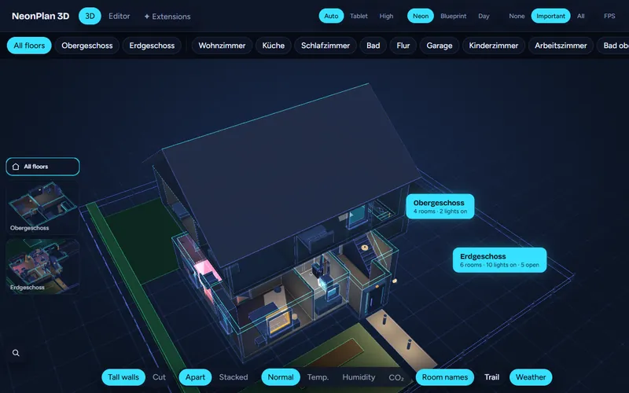
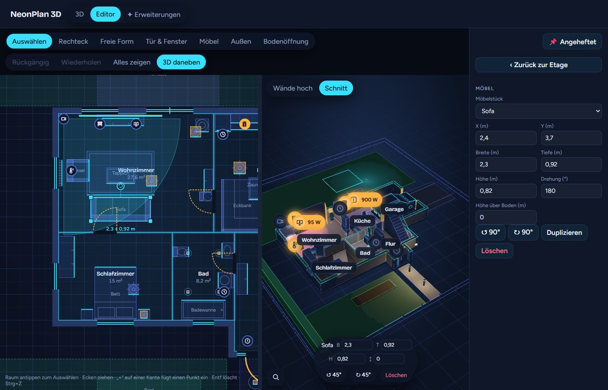
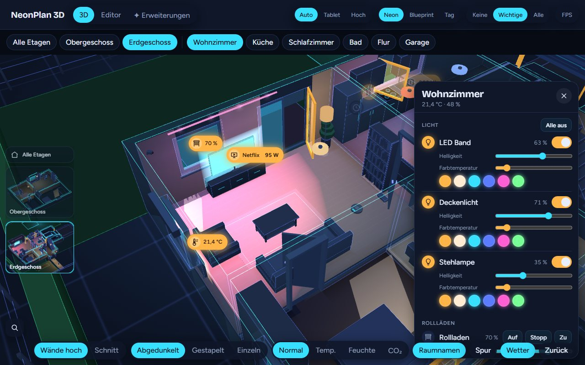
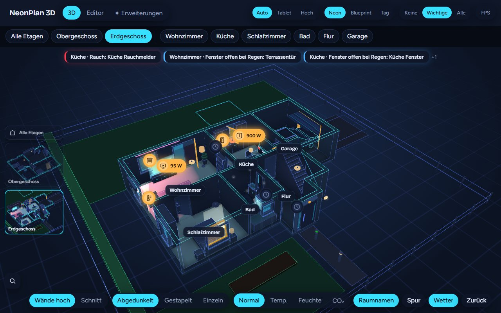

# NeonPlan 3D – version française

Fork en français de **[NeonPlan 3D](https://github.com/Mastershort/neonplan3d)** de **Mastershort** : dessinez votre maison directement dans Home Assistant et pilotez-la dans une vue 3D néon – les lumières brillent dans leurs couleurs, les volets bougent, portes et fenêtres s'ouvrent, les caméras surveillent et la TV affiche ce qui passe. Sans outil externe, sans cloud, pensé pour les tablettes murales.

Ce fork ajoute une **interface entièrement traduite en français** (affichée quand Home Assistant est réglé en français ; l'allemand et l'anglais restent disponibles). Tout le mérite du projet revient à son auteur original.

▶️ **[Démo en ligne de l'original](https://neonplan3d.mastershort.de/)** (en anglais/allemand, données inventées).

[](https://neonplan3d.mastershort.de/)

📖 **Manuel (original) :** [English](https://mastershort.de/en/neonplan3d/manual/?lang=en) · [Deutsch](https://mastershort.de/neonplan3d/anleitung/?lang=de)

## Ce que ça fait

| | |
|---|---|
|  | **Éditeur de plan dans Home Assistant** – étages, pièces en rectangles ou formes libres, murs automatiques et cloisons, portes, fenêtres, portes de garage, escaliers et trémies, espaces extérieurs et toit. La vue 3D tourne à côté du plan pendant que vous dessinez. |
|  | **Vue 3D en direct** – touchez une lampe pour la commuter, glissez pour varier, appui long pour les couleurs ; les volets suivent leur position, les fenêtres basculent et s'ouvrent, les portes pivotent. Un panneau liste tout ce que contient la pièce. |
|  | **Meubles et luminaires** – 40 modèles intégrés plus des packs de meubles. Les lampes éclairent leur pièce dans leur couleur, TV, lave-linge et radiateurs brillent quand ils fonctionnent. |
|  | **Caméras** – au mur ou au plafond avec leur champ de vision au sol, rouges quand elles détectent un mouvement ; un appui affiche l'image. |
|  | **Prêt pour tablette murale** – alertes fumée, gaz, eau, alarme et fenêtres ouvertes sous la pluie, mode kiosque avec retour automatique et atténuation nocturne, boutons de scène, et un niveau de qualité *Tablette*. |
|  | **Carte de tableau de bord** – `custom:neonplan3d-card` avec éditeur visuel, chargée automatiquement. |

Aussi inclus : places de parking avec véhicules qui apparaissent quand la voiture est là, carte thermique (température, humidité, CO₂), lumière du soleil par les fenêtres via `sun.sun`, trois apparences (*Néon*, *Plan bleu*, *Jour*), recherche, points de restauration et sauvegarde complète.

### Gratuit, packs et modules Pro

L'intégration est gratuite et open source (MIT). Des extras optionnels (packs de meubles, modules Pro) sont vendus par l'auteur original sur [mastershort.de](https://mastershort.de/en/neonplan3d/?lang=en) et s'installent depuis l'onglet **Extensions**.

## Installation

### HACS

[](https://my.home-assistant.io/redirect/hacs_repository/?owner=Eliajin&repository=neonplan3d-frenchversion&category=integration)

1. Cliquez sur le bouton ci-dessus, ou dans HACS : ⋮ → *Dépôts personnalisés* → ajoutez `https://github.com/Eliajin/neonplan3d-frenchversion` comme **Intégration**.
2. Installez **NeonPlan 3D** et redémarrez Home Assistant.
3. Ajoutez l'intégration : *Paramètres → Appareils et services → Ajouter une intégration → NeonPlan 3D*.
4. Ouvrez **NeonPlan 3D** dans la barre latérale, passez à l'**Éditeur** et dessinez votre premier étage.

L'interface est en français quand la langue de votre profil Home Assistant est le français.

### Remplacer la version originale

Les deux versions utilisent le même domaine `neonplan3d` : votre plan, vos images et vos packs (stockés dans `.storage`) sont conservés.

1. HACS → NeonPlan 3D (original) → ⋮ → **Supprimer** (ne supprimez **pas** l'intégration dans *Appareils et services*).
2. HACS → ⋮ → *Dépôts personnalisés* : retirez `Mastershort/neonplan3d`, ajoutez `https://github.com/Eliajin/neonplan3d-frenchversion` (type **Intégration**).
3. Installez **NeonPlan 3D** depuis ce dépôt, redémarrez Home Assistant, puis rechargez le navigateur (Ctrl+F5).

### Manuelle

Copiez `custom_components/neonplan3d` dans `config/custom_components/` et redémarrez Home Assistant.

Nécessite Home Assistant 2025.1 ou plus récent.

## Carte de tableau de bord

Toutes les options se règlent dans l'éditeur visuel de la carte ; en YAML :

```yaml
type: custom:neonplan3d-card
floor: floor_ab12cd34   # facultatif : un seul étage (id depuis l'éditeur)
height: 420             # facultatif : hauteur en pixels
fill: false             # facultatif : remplir l'écran au lieu d'une hauteur fixe
walls: auto             # facultatif : auto | cut
explode: true           # facultatif : écarter les étages dans la vue maison
floor_stack: dim        # facultatif : étages inférieurs : dim | stacked | single
quality: auto           # facultatif : auto | low | high
theme: neon             # facultatif : neon | blueprint | day
markers: important      # facultatif : none | important | all
heatmap: none           # facultatif : none | temperature | humidity | co2
room_panel: true        # facultatif : toucher une pièce ouvre ses détails
room_names: true        # facultatif : noms des pièces en 3D
controls: true          # facultatif : boutons dans la carte, ou une liste parmi walls, floors, temperature, humidity, co2
floor_thumbs: true      # facultatif : miniatures des étages
fullscreen_button: false
stats: false            # facultatif : indicateur de performance
alerts: true            # facultatif : fumée, gaz, CO, eau, alarme, fenêtres ouvertes sous la pluie
alert_jump: false       # facultatif : aller à la pièce d'une nouvelle alerte
scenes: true            # facultatif : boutons de scènes et scripts de la pièce sélectionnée
motion_trail: false     # facultatif : mouvements des 30 dernières minutes (Pro : cockpit caméra)
weather: true           # facultatif : météo extérieure (Pro : météo)
weather_entity: weather.home   # facultatif : quelle entité météo
idle_return: 0          # facultatif : kiosque – secondes sans contact avant le retour à la vue de départ
night: "off"            # facultatif : kiosque – atténuation nocturne : off | sun | "22:00-06:00"
idle_orbit: false       # facultatif : kiosque – rotation lente après le retour
```

## Alerte de mise à jour de l'original

Une fois par jour, l'intégration regarde sur GitHub la dernière version publiée du [NeonPlan 3D original](https://github.com/Mastershort/neonplan3d/releases). Si elle est plus récente que celle sur laquelle ce fork est basé, une alerte apparaît dans **Paramètres → Réparations** et un bandeau s'affiche en haut du panneau NeonPlan 3D (administrateurs uniquement).

Après avoir intégré la nouvelle version dans le fork (`git pull upstream main`, puis traduction des nouveaux textes dans `i18n-fr.ts`), mettez à jour `UPSTREAM_BASE_VERSION` dans `custom_components/neonplan3d/const.py` : l'alerte disparaît.

## Confidentialité

NeonPlan 3D stocke le plan, ses images et les packs dans le `.storage` de Home Assistant. Il contacte internet dans deux cas : une fois par jour l'API publique de GitHub pour connaître la dernière version de l'original (sans clé, aucune donnée de votre installation n'est envoyée), et, si vous saisissez une clé de licence dans **Extensions**, mastershort.de une fois par jour pour les mises à jour de vos packs.

## Développement

```bash
cd frontend
npm install
npm test            # logique pure
npm run typecheck
npm run build       # écrit les bundles dans custom_components/neonplan3d/frontend (versionnés)
npm run screenshot  # rend preview/index.html (données de démo) ; ?lang=fr pour le français
```

- Les textes français sont dans [`frontend/src/i18n-fr.ts`](frontend/src/i18n-fr.ts). Toute nouvelle clé ajoutée dans `i18n.ts` (par exemple lors d'une synchronisation avec l'original) doit y être traduite – sinon `npm run typecheck` échoue.
- Synchroniser avec l'original : `git remote add upstream https://github.com/Mastershort/neonplan3d` puis `git pull upstream main`.

## Licence

MIT – voir [LICENSE](LICENSE). © Mastershort pour le projet original. Les packs de meubles et modules Pro vendus dans la boutique ne font pas partie de ce dépôt.

Si le projet vous plaît, soutenez son auteur original : [PayPal](https://www.paypal.com/donate/?hosted_button_id=Z3G2VWKSK5VJL) · [boutique](https://mastershort.de/neonplan3d/).
